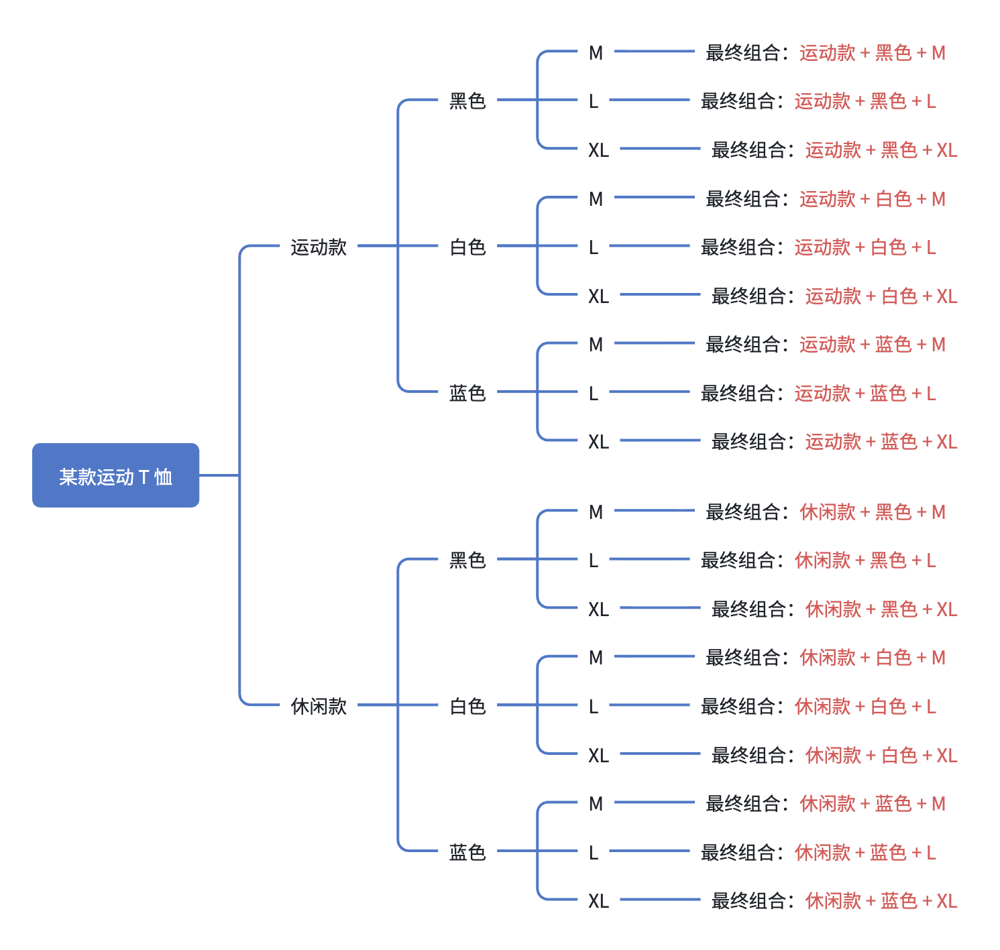

# 电商 SKU 系统设计（一）：基于笛卡尔积的 SKU 建模实践

---

## 1. 开篇：一个所有电商都要解决的问题

在电商 App 中，我们经常会看到这样的商品规格选择界面：


在这个界面中，用户可以通过不同规格组合来选择商品。

但这里隐藏着两个核心问题：

```
为什么有些规格可以选择？
为什么有些规格会被置灰？
```

例如，当用户选择 **黑色** 之后：

```
尺码：

M   ✔
L   ❌（无库存）
XL  ❌（不存在）
```

系统需要实时判断：

* 哪些规格可以选择
* 哪些规格应该置灰
* 哪些规格是库存不足

这背后本质是一个经典问题：

> 👉 SKU 系统的状态计算问题

---

## 2. SKU 基本概念

在继续之前，我们先统一 3 个核心概念。

---

### 1. SPU（Standard Product Unit）

SPU 表示**标准商品单元**，即“商品本体”。

例如：

* iPhone 15
* Nike Air Force 1

👉 SPU = 不带规格的抽象商品

---

### 2. Spec（规格维度）

Spec 表示商品的**可选维度**，例如：

* 颜色（黑 / 白 / 蓝）
* 尺码（M / L / XL）
* 款式（运动 / 休闲）

👉 Spec = 决策维度（维度本身）

---

### 3. SKU（Stock Keeping Unit）

SKU 是**最小库存单元**，由一组规格组合唯一确定。

例如：

```
黑色 + M + 运动款
```

每个 SKU 对应：

* 唯一 ID
* 价格
* 库存

---

### ✔ 核心关系总结

> SPU 是商品本体
> Spec 是规格维度
> SKU 是规格组合结果

---

## 3. SKU 的数学本质：笛卡尔积

### 举个例子

一个商品有如下规格：

```
颜色：3种（黑 / 白 / 蓝）
尺码：3种（M / L / XL）
款式：2种（运动 / 休闲）
```

理论组合数量为：

```
3 × 3 × 2 = 18
```

在数学上，这种组合关系称为：

> 👉 笛卡尔积（Cartesian Product）

---

### 可视化理解



---

### ⚠️ 现实情况

实际业务中：

❌ 并不是所有组合都存在

例如：

```
黑色 + L + 休闲  ❌（不存在该 SKU）
```

---

### ✔ 核心结论（非常重要）

> SKU 系统的本质是：
> 在“理论笛卡尔积”中，筛选出“真实存在的组合”

---

## 4. 如何设计一个通用 SKU 数据模型？

SKU 系统本质是对“组合关系”的表达，因此需要描述两类信息：

```
① 规格维度（Spec）
② 真实 SKU 组合（SKU）
```

因此核心模型为：

```
specList
skuList
```

---

### 一个完整的结构示例

```json
{
  "specList": [
    {
      "specId": "style",
      "specName": "款式",
      "values": [
        {
          "id": "sport",
          "name": "运动款"
        },
        {
          "id": "casual",
          "name": "休闲款"
        }
      ]
    },
    {
      "specId": "color",
      "specName": "颜色",
      "values": [
        {
          "id": "black",
          "name": "黑色"
        },
        {
          "id": "white",
          "name": "白色"
        },
        {
          "id": "blue",
          "name": "蓝色"
        }
      ]
    },
    {
      "specId": "size",
      "specName": "尺码",
      "values": [
        {
          "id": "m",
          "name": "M"
        },
        {
          "id": "l",
          "name": "L"
        },
        {
          "id": "xl",
          "name": "XL"
        }
      ]
    }
  ],
  "skuList": [
    {
      "skuId": "1",
      "price": 199.0,
      "stock": 12,
      "specs": {
        "color": "black",
        "size": "m",
        "style": "sport"
      }
    },
    {
      "skuId": "2",
      "price": 199.0,
      "stock": 0,
      "specs": {
        "color": "black",
        "size": "l",
        "style": "sport"
      }
    }
  ],
  "defaultSkuId": "1"
}
```

---

### ✔ 模型表达的核心思想

#### specList → “有哪些维度”

* 定义可选空间

---

#### skuList → “哪些组合真实存在”

* 表达真实商品库存单位

---

### ✔ 一个关键认知

> 前端不是在“生成组合”，而是在“匹配已有 SKU”

---

## 5. SKU 选择算法（核心思想）

回到最核心问题：

> 系统如何判断某个规格是否可选？

---

### 示例

当前选择：

```
颜色 = 黑色
尺码 = M
```

判断：

```
款式 = 运动 是否可选？
```

---

### 算法过程

#### Step 1：构造假设组合

```
黑色 + M + 运动
```

---

#### Step 2：匹配 skuList

检查是否存在该组合 SKU。

---

#### Step 3：状态判断

结果分三类：

```
不存在 SKU → DISABLED（不可选）

存在但库存 = 0 → OUT_OF_STOCK（售罄）

存在且库存 > 0 → ENABLED（可选）
```

---

### ✔ 核心算法本质

> 当前选择 + 组合推演 + SKU 匹配

---

## 6. 为什么 SKU 选择必须在客户端执行？

这是一个典型的架构分工问题。

---

### ❌ 如果放在服务端

* 每次点击都请求接口
* 状态组合爆炸
* 延迟高、体验差

---

### ✔ 正确方式

> 一次性返回 skuList，由客户端计算状态

---

### 优势

* 无网络延迟
* 状态实时更新
* 可扩展性强
* 逻辑集中在本地

---

## 7. 本文设计边界说明

为了聚焦核心 SKU 模型，本示例做了适当简化：

* ❌ 未包含 SKU 图片 / 名称联动
* ❌ 未处理价格区间（如 ¥199~¥299）
* ❌ defaultSkuId 为服务端固定返回
* ❌ 未涉及库存锁定 / 并发扣减

---

### ✔ 实际业务扩展方向

* SKU 图片随规格联动变化
* 多价格体系（活动价 / 会员价）
* 默认 SKU 动态推荐（库存 / 销量）
* 更复杂的库存与促销体系

---

## 8. 总结

这一篇我们建立了 SKU 系统的三个核心认知：

---

### ✔ 1. SKU 的本质

> 规格组合（笛卡尔积的子集）

---

### ✔ 2. 数据模型

> specList + skuList

---

### ✔ 3. 状态判断机制

> 当前选择 + 组合推演 + SKU 匹配

---

## 9. 下一篇预告

在完成数据建模之后，下一个问题是：

> ❓ 服务端如何设计 SKU 数据结构并对外提供接口？

---

👉 下一篇将进入：

[《电商 SKU 系统设计（二）：服务端 SKU 建模与接口设计》](sku-part2.md)

内容包括：

* 数据库设计
* SKU 与规格关系建模
* 查询流程设计
* 接口结构组装

---

👉 如果你更关注客户端实现，也可以直接阅读：

[《电商 SKU 系统设计（三）：Android SKU 选择引擎实现》](sku-part3.md)

实现完整 SKU 选择逻辑与状态联动机制

---

