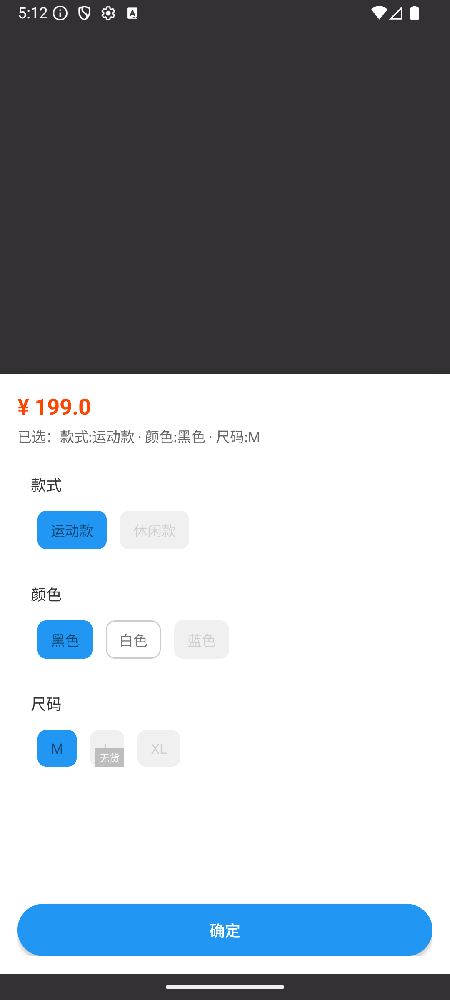

# 电商 SKU 系统设计（三）：Android SKU 选择引擎实现

在前两篇中：

👉 [电商 SKU 系统设计（一）：SKU 建模与数据结构设计（基于笛卡尔积）](./sku-part1.md)

👉 [电商 SKU 系统设计（二）：服务端 SKU 建模与接口设计](./sku-part2.md)

我们已经完成了：

* SKU 的本质（规格组合）
* 服务端数据结构（`specList` + `skuList`）

这一篇进入客户端部分，目标是：
> 根据服务端返回的 `specList` + `skuList` 实现 SKU 选择能力。

## 1. 我们要实现什么效果？



从页面可以拆解出 3 个核心能力：

1. 展示**规格列表**
2. 处理规格的**选中 / 取消选中**
3. 动态计算每个规格值的**状态: 可选 / 不可选 / 售罄 / 已选中**

## 2. 状态定义：规格值是如何变灰的？

在编写代码之前，我们需要理清四种核心状态的逻辑关系。这本质上是在维护一个**动态的状态机**：

* **SELECTED（已选）**：用户当前主动点击的规格。
* **ENABLED（可选）**：在当前已选条件下，该规格值能找到**至少一个**有库存的 SKU。
* **OUT_OF_STOCK（售罄）**：在当前已选条件下，该规格值对应的组合确实存在，但**所有匹配到的 SKU 库存均为 0**。
* **DISABLED（不可选）**：在当前已选条件下，该规格值与已选规格组合后，在 `skuList` 中**找不到任何对应的有效 SKU**。

> **核心逻辑**：每当用户点击一次规格，我们就需要针对**全量**的规格值，重新进行一次“路径匹配”计算。

## 3. 从 UI 出发：我们到底需要什么数据？

现在，我们有了 `specList` + `skuList`。

但是这个 JSON 数据中没有状态。从 UI 出发，我们到底需要什么数据？答案是：

1. `List<SpecResult>`：用于规格展示（带状态）
2. `SkuResult`：当前选中的 SKU 结果

### 规格状态枚举

```kotlin
enum class SpecValueStatus {
    ENABLED,      // 可选
    DISABLED,     // 不可选
    OUT_OF_STOCK, // 售罄
    SELECTED      // 已选中
}
```

### UI 展示结构

```kotlin
data class SpecResult(
    val specId: String,
    val specName: String,
    val values: List<SpecValueResult>
)

data class SpecValueResult(
    val id: String,
    val name: String,
    val status: SpecValueStatus
)
```

`SpecResult` 相较于服务端 `specList`，在规格值层增加了 `SpecValueStatus`，用于描述当前规格值在不同选择状态下的可用性。

### SKU 选择结果

```kotlin
data class SkuResult(
    val skuId: String,
    val price: Double,
    val stock: Int,
    val specs: List<SelectedSpec>
)

data class SelectedSpec(
    val specId: String,
    val specName: String,
    val valueId: String,
    val valueName: String
)
```

`SkuResult` 相较于服务端 `skuList`，将规格信息从 `Map` 结构转换为结构化的 `SelectedSpec` 列表，用于更清晰地表达当前 SKU
的完整规格组合信息。

## 4. UI 与 ViewModel 职责划分

有了数据结构后，UI 需要随着用户操作自动更新。在 Android 中，推荐使用 StateFlow 驱动 UI。

### UI 层职责

UI 只做两件事：

1. 初始化 → 渲染数据
2. 点击规格 → 更新页面

```kotlin
// 规格 UI
viewModel.specUiList.collect { list ->
    specAdapter.submitList(list)
}

// SKU 结果
viewModel.selectedSku.collect { sku ->
    updateSkuUi(sku)
}

// 初始化
viewModel.initSku()

// 点击规格
specAdapter = SpecAdapter { specId, valueId ->
    viewModel.selectSpec(specId, valueId)
}
```

### ViewModel 职责

`ViewModel` 同样只做两件事：

1. 初始化 → 返回 `List<SpecResult>` + `SkuResult`
2. 点击规格 → 返回 `List<SpecResult>` + `SkuResult`

代码如下：

```kotlin
class SkuViewModel : ViewModel() {

    private val _specUiList = MutableStateFlow<List<SpecResult>>(emptyList())
    val specUiList = _specUiList.asStateFlow()

    private val _selectedSku = MutableStateFlow<SkuResult?>(null)
    val selectedSku = _selectedSku.asStateFlow()

    fun initSku() {
        _specUiList.value = skuEngine.initSpecStatus()
        _selectedSku.value = skuEngine.getSelectedSku()
    }

    fun selectSpec(specId: String, valueId: String) {
        _specUiList.value = skuEngine.select(specId, valueId)
        _selectedSku.value = skuEngine.getSelectedSku()
    }
}
```

👉 可以看到：

`ViewModel` 不负责任何 SKU 计算，只负责状态流转，所有计算交给 `SkuEngine`。

如果把 SKU 逻辑直接写在 `ViewModel` 中，会导致：

* 逻辑混乱
* 难以维护
* 无法复用

因此，将其抽离为独立模块：

> 👉 SkuEngine

## 5. SkuEngine 设计

### SkuEngine 职责

`SkuEngine` 只负责一件事：

```text
输入：
- specList（规格定义）
- skuList（有效 SKU）

输出：
- List<SpecResult>（UI 展示数据）
- SkuResult（当前选中结果）
```

👉 本质上，它解决的是：

> 将服务端返回的数据，转换为客户端可直接使用的状态数据

### 核心实现逻辑（伪代码）

#### A. 维护“当前选择”

引擎内部维护一个 `Map`，记录用户的点击轨迹。

```kotlin
private val selectedSpecMap = mutableMapOf<String, String>() // <specId, valueId>
```

#### B. 核心：计算规格状态（计算每一个 Cell 的颜色）

这是引擎的灵魂。每当状态变化，我们会对**每一个**规格值执行以下校验逻辑：

```kotlin
fun calculateStatus(targetSpecId: String, targetValueId: String): SpecValueStatus {
    // 1. 如果是当前已选，直接返回 SELECTED
    if (selectedSpecMap[targetSpecId] == targetValueId) return SELECTED

    // 2. 关键：假设法校验
    // 拷贝一份当前选择，并将正在校验的这个值“假装”选进去
    val tempSelected = selectedSpecMap + (targetSpecId to targetValueId)

    // 3. 在 skuList 中寻找符合 tempSelected 条件的所有 SKU
    val matchedSkus = skuList.filter { it.matches(tempSelected) }

    // 4. 根据匹配结果定生死
    return when {
        matchedSkus.isEmpty() -> DISABLED       // 根本没这个组合
        matchedSkus.any { it.stock > 0 } -> ENABLED // 只要有一个有货就行
        else -> OUT_OF_STOCK                    // 有组合但全卖光了
    }
}
```

#### C. 数据转换逻辑（从 List 到 UI Model）

```kotlin
fun buildSpecUI(): List<SpecResult> {
    return specList.map { spec ->
        SpecResult(
            specId = spec.specId,
            values = spec.values.map { value ->
                SpecValueResult(
                    id = value.id,
                    status = calculateStatus(spec.specId, value.id) // 核心调用点
                )
            }
        )
    }
}
```

## 6. 性能优化与架构思考

### 时间复杂度

每次点击都会遍历所有规格值。

假设：

* M 个规格
* N 个规格值
* K 个 SKU

复杂度约为：

O(M × N × K)

在普通电商场景（K < 500）中，Android 端通常 < 5ms，可忽略。

### 为什么不推荐复杂算法？

虽然图结构或邻接矩阵更高效，但：

* 实现复杂
* 调试困难
* 可维护性差

对于 95% 的业务场景：

> “假设校验法”才是工程上的最优解

## 7. 总结

这一篇完成了 SKU 系统最关键的一环：

> **逻辑与 UI 的彻底分离**

* `UI`：只负责响应用户操作
* `ViewModel`：负责状态流转
* `SkuEngine`：负责复杂逻辑计算与转换

最终效果：


**Android 完整代码示例：**
👉 [sku-engine-android](https://github.com/yuncodelab/sku-engine-android)

---

> 系列回顾：
>
> * [电商 SKU 系统设计开篇](./index.md)
> * [第一篇：数据结构设计（基于笛卡尔积）](./sku-part1.md)
> * [第二篇：服务端 SKU 接口与数据设计](./sku-part2.md)
> * 第三篇：Android SKU 选择引擎实现（本文）


